  

# 1-Bit Adder to 8-Bit ALU

This project demonstrates the step-by-step development of digital logic circuits using **VHDL**, starting from simple NAND gates and gradually building toward a complete **8-bit Arithmetic Logic Unit (ALU)**.

The project includes combinational circuits, sequential circuits, registers, multiplexers, arithmetic units, logic units, and the final 8-bit ALU.

---

## Project Development Flow

NAND Gate  
↓  
Basic Logic Gates  
↓  
XOR Gate  
↓  
Half Adder  
↓  
Full Adder  
↓  
4-Bit Adder  
↓  
8-Bit Ripple Carry Adder  
↓  
SR Latch  
↓  
D Latch  
↓  
Master-Slave Flip-Flop  
↓  
1-Bit Register  
↓  
8-Bit Register  
↓  
Arithmetic Unit  
↓  
Logic Unit  
↓  
8-Bit ALU  

---

# 1. NAND Gate

The NAND gate is the basic building block of this project.

A NAND gate produces logic `0` only when both inputs are `1`.

### Truth Table

| A | B | Output |
|---|---|---|
| 0 | 0 | 1 |
| 0 | 1 | 1 |
| 1 | 0 | 1 |
| 1 | 1 | 0 |

---

# 2. NAND as a Universal Gate

NAND is known as a **universal gate** because other logic gates can be implemented using only NAND gates.

  

Using NAND gates, this project implements:

- NOT Gate
- AND Gate
- OR Gate
- XOR Gate

---

## NOT Gate

A NOT gate reverses the input.

- `0 → 1`
- `1 → 0`

---

## AND Gate

The AND gate produces logic `1` only when both inputs are `1`.

| A | B | Output |
|---|---|---|
| 0 | 0 | 0 |
| 0 | 1 | 0 |
| 1 | 0 | 0 |
| 1 | 1 | 1 |

---

## OR Gate

The OR gate produces logic `1` when at least one input is `1`.

| A | B | Output |
|---|---|---|
| 0 | 0 | 0 |
| 0 | 1 | 1 |
| 1 | 0 | 1 |
| 1 | 1 | 1 |

---

## XOR Gate

The XOR gate produces logic `1` when the two inputs are different.

| A | B | Output |
|---|---|---|
| 0 | 0 | 0 |
| 0 | 1 | 1 |
| 1 | 0 | 1 |
| 1 | 1 | 0 |

---

# 3. Half Adder

A half adder adds two single-bit binary numbers.

### Inputs

- `A`
- `B`

### Outputs

- `SUM`
- `CARRY`

### Equations

`SUM = A XOR B`

`CARRY = A AND B`

### Truth Table

| A | B | SUM | CARRY |
|---|---|---|---|
| 0 | 0 | 0 | 0 |
| 0 | 1 | 1 | 0 |
| 1 | 0 | 1 | 0 |
| 1 | 1 | 0 | 1 |

---

# 4. Full Adder

A full adder adds three binary inputs:

- `A`
- `B`
- `Cin`

and produces:

- `SUM`
- `Cout`

### Equations

`SUM = A XOR B XOR Cin`

`Cout = AB + Cin(A XOR B)`

The full adder is the basic building block for multi-bit addition.

---

# 5. 4-Bit Adder

Four full adders are connected together to create a 4-bit binary adder.

The carry output of one full adder becomes the carry input of the next stage.

`FA0 → FA1 → FA2 → FA3`

---

# 6. 8-Bit Ripple Carry Adder

Eight full adders are connected together to create an 8-bit ripple carry adder.

  

The carry signal propagates from one stage to the next.

`FA0 → FA1 → FA2 → FA3 → FA4 → FA5 → FA6 → FA7`

Because the carry moves through each stage one after another, this design is called a **ripple carry adder**.

---

# 7. Sequential Logic

Sequential circuits can store information.

Their outputs depend on:

- Current input
- Previous state

The sequential section follows this development:

SR Latch  
↓  
D Latch  
↓  
Master-Slave Flip-Flop  
↓  
1-Bit Register  
↓  
8-Bit Register  

---

# 8. SR Latch

The SR latch is one of the simplest memory circuits.

### Inputs

- `S` = Set
- `R` = Reset

### Outputs

- `Q`
- `Q̅`

The SR latch can store one bit of information.

---

# 9. D Latch

The D latch improves the SR latch by avoiding invalid input conditions.

### Inputs

- `D`
- `Enable`

### Output

- `Q`

When the enable signal is active, the output follows the input.

When the enable signal is inactive, the previous value is stored.

---

# 10. Master-Slave Flip-Flop

A master-slave flip-flop is constructed using two latch stages.

  

The two main stages are:

`Master Stage → Slave Stage`

The master and slave operate on opposite clock phases.

This allows the output to change only at the appropriate clock transition.

---

# 11. 1-Bit Register

A 1-bit register stores one binary value.

It is constructed using a flip-flop and keeps its value until the next active clock event.

---

# 12. 8-Bit Register

Eight 1-bit registers are combined to create an 8-bit register.

The register can store one 8-bit binary value.

---

# 13. Multiplexers

Multiplexers are used to select between different input signals.

This project includes:

- `mux2.vhd`
- `mux4.vhd`

## 2-to-1 Multiplexer

A 2-to-1 multiplexer selects one of two input signals.

## 4-to-1 Multiplexer

A 4-to-1 multiplexer selects one of four inputs depending on the select signals.

---

# 14. Arithmetic Unit

The arithmetic unit performs binary arithmetic operations.

The project includes:

`alu_arith_unit.vhd`

This unit is built using the adder circuits developed earlier in the project.

---

# 15. Logic Unit

The logic unit performs logical operations on 8-bit inputs.

The project includes:

`alu_logic_unit.vhd`

Typical logical operations include:

- AND
- OR
- XOR
- NOT

---

# 16. Zero Detector

The project includes an 8-bit zero detector:

`zero_detect_8.vhd`

The zero detector checks whether the ALU output is:

`00000000`

If all bits are zero, a zero flag can be generated.

---

# 17. 8-Bit ALU

The final stage of the project is the **8-bit Arithmetic Logic Unit**.

The main file is:

`alu_8bit.vhd`

The ALU combines:

- Arithmetic operations
- Logical operations
- Multiplexers
- Control signals
- Zero detection

The ALU receives two 8-bit inputs and performs the required operation according to the control signals.

---

# Main VHDL Files

| File | Description |
|---|---|
| `nand_gate.vhd` | NAND gate |
| `not_gate.vhd` | NOT gate |
| `and_gate.vhd` | AND gate |
| `or_gate.vhd` | OR gate |
| `xor_gate.vhd` | XOR gate |
| `half_adder.vhd` | Half adder |
| `full_adder.vhd` | Full adder |
| `adder_4bit.vhd` | 4-bit adder |
| `adder_8bit.vhd` | 8-bit ripple carry adder |
| `sr_latch.vhd` | SR latch |
| `d_latch.vhd` | D latch |
| `master_slave_ff.vhd` | Master-slave flip-flop |
| `register_1bit.vhd` | 1-bit register |
| `register_8bit.vhd` | 8-bit register |
| `mux2.vhd` | 2-to-1 multiplexer |
| `mux4.vhd` | 4-to-1 multiplexer |
| `alu_arith_unit.vhd` | Arithmetic unit |
| `alu_logic_unit.vhd` | Logic unit |
| `alu_8bit.vhd` | Final 8-bit ALU |
| `zero_detect_8.vhd` | 8-bit zero detector |

---

# Testbench Files

The project also contains testbench files used for simulation and verification.

Examples include:

- `nand_gate_tb.vhd`
- `not_gate_tb.vhd`
- `and_gate_tb.vhd`
- `or_gate_tb.vhd`
- `xor_gate_tb.vhd`
- `half_adder_tb.vhd`
- `full_adder_tb.vhd`
- `adder_4bit_tb.vhd`
- `adder_8bit_tb.vhd`
- `sr_latch_tb.vhd`
- `d_latch_tb.vhd`
- `master_slave_ff_tb.vhd`
- `register_1bit_tb.vhd`
- `register_8bit_tb.vhd`
- `mux2_tb.vhd`
- `mux4_tb.vhd`
- `alu_arith_unit_tb.vhd`
- `alu_logic_unit_tb.vhd`
- `alu_8bit_tb.vhd`
- `zero_detect_8_tb.vhd`

---

# Project Structure

1 BIT ADDER TO ALU/

- `README.md`
- `banner.svg`
- `nand-universal.svg`
- `ripple-carry.svg`
- `master-slave-ff.svg`
- `nand_gate.vhd`
- `nand_gate_tb.vhd`
- `not_gate.vhd`
- `not_gate_tb.vhd`
- `and_gate.vhd`
- `and_gate_tb.vhd`
- `or_gate.vhd`
- `or_gate_tb.vhd`
- `xor_gate.vhd`
- `xor_gate_tb.vhd`
- `half_adder.vhd`
- `half_adder_tb.vhd`
- `full_adder.vhd`
- `full_adder_tb.vhd`
- `adder_4bit.vhd`
- `adder_4bit_tb.vhd`
- `adder_8bit.vhd`
- `adder_8bit_tb.vhd`
- `sr_latch.vhd`
- `sr_latch_tb.vhd`
- `d_latch.vhd`
- `d_latch_tb.vhd`
- `master_slave_ff.vhd`
- `master_slave_ff_tb.vhd`
- `register_1bit.vhd`
- `register_1bit_tb.vhd`
- `register_8bit.vhd`
- `register_8bit_tb.vhd`
- `mux2.vhd`
- `mux2_tb.vhd`
- `mux4.vhd`
- `mux4_tb.vhd`
- `alu_arith_unit.vhd`
- `alu_arith_unit_tb.vhd`
- `alu_logic_unit.vhd`
- `alu_logic_unit_tb.vhd`
- `zero_detect_8.vhd`
- `zero_detect_8_tb.vhd`
- `alu_8bit.vhd`
- `alu_8bit_tb.vhd`

---

# Tools Used

- VHDL
- Xilinx ISE
- ISim
- Git
- GitHub

---

# Learning Objectives

This project demonstrates how complex digital systems can be built from basic logic components.

The overall development path is:

NAND Gates  
↓  
Basic Logic Gates  
↓  
Adders  
↓  
Multi-bit Adders  
↓  
Latches  
↓  
Flip-Flops  
↓  
Registers  
↓  
Arithmetic Unit  
↓  
Logic Unit  
↓  
8-Bit ALU  

The project provides practical experience with:

- Digital logic design
- Boolean logic
- VHDL
- Hierarchical circuit design
- Combinational circuits
- Sequential circuits
- Binary arithmetic
- Simulation
- Testbenches
- ALU architecture

---

# Visual Overview

## NAND-Based Logic

  

## 8-Bit Ripple Carry Architecture

  

## Master-Slave Storage Architecture

  

---

# Author

**SaswataGA**

VLSI Laboratory Project
