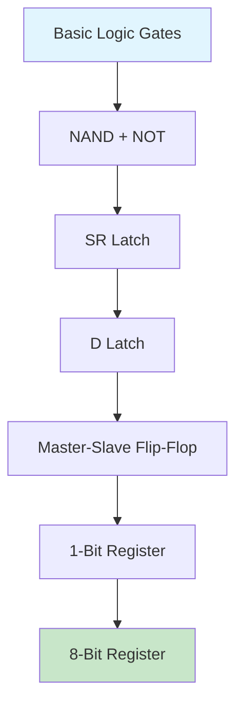

```markdown
8-Bit Register — VLSI Lab

Hierarchical VHDL Design from NAND Gate → 8-Bit Register

Designed, implemented, simulated, and verified using VHDL and Xilinx ISE 14.7.

📌 Project Overview

This project presents the structural design and simulation of an 8-bit Register using a bottom-up hierarchical design methodology.

Instead of directly describing the complete register using behavioral VHDL, the circuit is developed step-by-step from basic digital building blocks. Each module is designed and tested independently and then used as a component in the next level of the hierarchy.

The complete design demonstrates how a simple NAND gate can be progressively combined to create storage elements and finally an 8-bit register capable of storing an 8-bit binary value.

Design Hierarchy
                    NAND Gate
                        │
                        ▼
                    NOT Gate
                        │
                        ▼
                    SR Latch
                        │
                        ▼
                    D Latch
                        │
                        ▼
              Master-Slave Flip-Flop
                        │
                        ▼
                  1-Bit Register
                        │
                    × 8 Bits
                        │
                        ▼
                  8-Bit Register
```


---

## Objectives

- Design & simulate a **2-input NAND gate**
- Design & simulate a **NOT gate**
- Construct an **SR Latch** using NAND gates
- Design & verify a **D Latch**
- Construct a **Master-Slave Flip-Flop**
- Design & verify a **1-Bit Register**
- Build an **8-Bit Register** by instantiating eight 1-bit registers
- Verify everything with VHDL testbenches + waveform analysis
- Demonstrate hierarchical & reusable digital design

---

## Design Flow



---

## Architecture

```text
┌────────────────────────────────────┐
│          8-BIT REGISTER            │
└─────────────────┬──────────────────┘
                  │
        ┌─────────┴─────────┐
        │                   │
        ▼                   ▼
   ┌─────────┐         ┌─────────┐
   │ 1-BIT   │   × 8   │ 1-BIT   │
   │ REGISTER│         │ REGISTER│
   └────┬────┘         └────┬────┘
        │                   │
        └─────────┬─────────┘
                  ▼
         Master-Slave Flip-Flop
                  ▼
               D Latch
                  ▼
              SR Latch
                  ▼
            NAND + NOT
```

---

## Design Components

<details>
<summary><strong>1. NAND Gate</strong> (click to expand)</summary>

**Function:** `Y = NOT(A AND B)`

| A | B | Y |
|---|---|---|
| 0 | 0 | 1 |
| 0 | 1 | 1 |
| 1 | 0 | 1 |
| 1 | 1 | 0 |

Used as the fundamental building block for the SR Latch.

</details>

<details>
<summary><strong>2. NOT Gate</strong> (click to expand)</summary>

**Function:** `Y = NOT(A)`

| A | Y |
|---|---|
| 0 | 1 |
| 1 | 0 |

</details>

<details>
<summary><strong>3. SR Latch</strong> (click to expand)</summary>

Constructed from cross-coupled NAND gates. Provides basic 1-bit memory.

| Operation | Description              |
|-----------|--------------------------|
| SET       | Stores `1`               |
| RESET     | Stores `0`               |
| HOLD      | Maintains previous state |

```text
S ──► NAND ─── Q
         │
         │  (cross-coupled)
         │
R ──► NAND ─── Q̅
```

</details>

<details>
<summary><strong>4. D Latch</strong> (click to expand)</summary>

Built from the SR Latch. Controlled storage of a single data bit.

| Signal | Description   |
|--------|---------------|
| `D`    | Data input    |
| `EN`   | Enable        |
| `Q`    | Stored output |

**Behavior:**
- `EN = 1` → `Q` follows `D`
- `EN = 0` → `Q` holds previous value

</details>

<details>
<summary><strong>5. Master-Slave Flip-Flop</strong> (click to expand)</summary>

Two D latches connected in series and clocked on opposite phases.

```text
D ──► [ Master Latch ] ──► [ Slave Latch ] ──► Q
```

Enables clean edge-triggered data transfer.

</details>

<details>
<summary><strong>6. 1-Bit Register</strong> (click to expand)</summary>

Built around the Master-Slave Flip-Flop.

| Signal  | Description          |
|---------|----------------------|
| `CLK`   | Clock                |
| `RESET` | Asynchronous reset   |
| `LOAD`  | Load enable          |
| `D`     | Data input           |
| `Q`     | Stored output        |

**Operation:**
- `RESET = 1` → Register cleared
- `LOAD = 1`  → Input data stored
- `LOAD = 0`  → Previous data retained

</details>

<details>
<summary><strong>7. 8-Bit Register</strong> (click to expand)</summary>

Eight instances of the 1-bit register sharing common control signals.

| Signal     | Description              |
|------------|--------------------------|
| `D[7:0]`   | 8-bit data input         |
| `CLK`      | Common clock             |
| `RESET`    | Common reset             |
| `LOAD`     | Common load enable       |
| `Q[7:0]`   | 8-bit stored output      |

```text
┌────────────────────────────────┐
│         8-BIT REGISTER         │
│                                │
│  D[7:0]  ─────────────────────►│
│  CLK     ─────────────────────►│
│  RESET   ─────────────────────►│
│  LOAD    ─────────────────────►│
│                                │
│                      Q[7:0] ───│
└────────────────────────────────┘
```

</details>

---

## Hierarchical Structure

```text
8-Bit Register
├── 1-Bit Register × 8
│   └── Master-Slave Flip-Flop
│       └── D Latch
│           └── SR Latch
│               └── NAND Gates + NOT Gate
```

---

## Simulation & Verification

Every stage was verified with a dedicated VHDL testbench:

```text
VHDL Design
    ⬇
Testbench
    ⬇
Behavioral Simulation (ISim)
    ⬇
Waveform Analysis
    ⬇
Functional Verification
```

### Verification Summary

| Component                | Status                          |
|--------------------------|---------------------------------|
| NAND Gate                | Truth table verified            |
| NOT Gate                 | Inversion verified              |
| SR Latch                 | Set / Reset / Hold verified     |
| D Latch                  | Data storage verified           |
| Master-Slave Flip-Flop   | Clocked transfer verified       |
| 1-Bit Register           | Load & Reset verified           |
| 8-Bit Register           | 8-bit storage verified          |

---


---

## Tools & Technologies

| Tool / Technology     | Purpose                        |
|-----------------------|--------------------------------|
| **VHDL**              | Hardware description           |
| **Xilinx ISE 14.7**   | Design & synthesis             |
| **ISim**              | Behavioral simulation          |
| **VHDL Testbenches**  | Functional verification        |
| **RTL / Schematic**   | Design representation          |
| **Git & GitHub**      | Version control                |

---

**Educational project** — VLSI Laboratory
```
